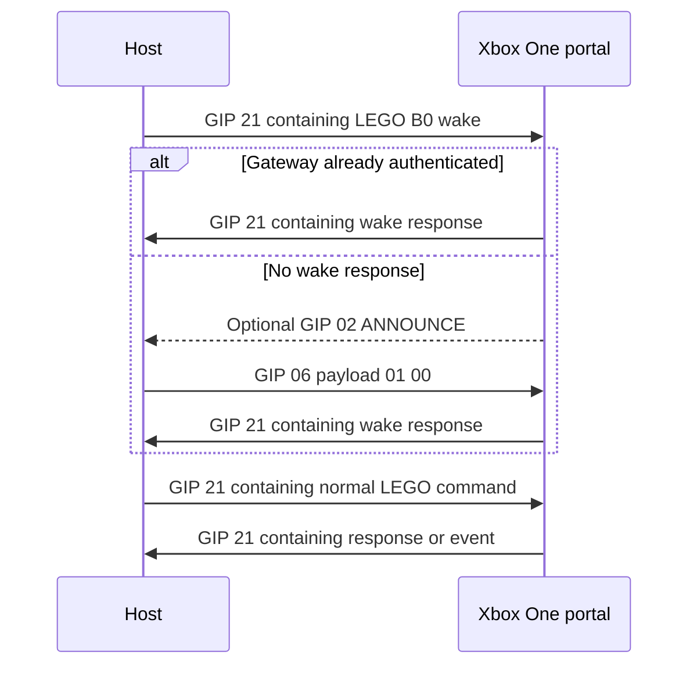

# Xbox One Lego Dimensions Portal Protocol

This document describes the protocol used by the Xbox One Lego Dimensions portal
with USB ID `0E6F:0141`. It records behavior verified with real hardware and the
[`XboxPortalProbe`](XboxPortalProbe/) diagnostic application.

The Xbox One portal does not expose the ordinary 32-byte Lego Dimensions protocol
directly. It transports those messages inside Xbox Game Input Protocol (GIP)
command `0x21`:

```text
USB interrupt transfer
└── GIP packet
    └── command 0x21 payload
        └── 32-byte Lego Dimensions message
```

The embedded messages use the same commands and checksums as non-Xbox portals.
See [Lego Dimensions Communication Protocol](LegoDimensionsProtocol.md) for the
command details and tag data format shared by all portals.

For a packet-by-packet explanation of a real console exchange, including GIP
identification, chunk acknowledgments, authentication certificate transfer, and
wrapped LEGO wake attempts, see [Xbox One portal capture decode](XboxOnePortalCaptureDecoded.md).

## Status and scope

The following behavior has been verified on an Xbox One portal with product ID
`0x0141`:

- Device discovery, configuration, and endpoint access through WinUSB/libusb.
- GIP announcement parsing.
- Operational initialization using LEGO wake followed by GIP authentication
  completion.
- GIP `0x21` transport in both directions.
- LEGO command responses and unsolicited tag events.
- GIP IDENTIFY chunk reassembly and acknowledgments.
- Seed, challenge, light effects, tag listing, tag reading, NFC control, password
  mode, model, and tag-write command framing.

The main `LegoPortal` class detects product ID `0x0141`, performs the initialization
sequence below, and wraps or unwraps GIP automatically. Applications can use the
same public API as they use for a standard portal.

This document does not describe the Xbox 360 portal or claim that its transport is
the same; see the dedicated [Xbox 360 portal protocol](Xbox360PortalProtocol.md).
Replacing the Windows driver may prevent the portal from working with an Xbox
until the Microsoft driver is restored.

## USB transport

| Property | Value |
| --- | --- |
| Vendor ID | `0x0E6F` |
| Product ID | `0x0141` |
| Interface | First interface, normally `0` |
| Host-to-portal endpoint | `0x01` |
| Portal-to-host endpoint | `0x81` |
| Tested Windows driver | WinUSB |

The host should perform these USB steps:

1. Open the device.
2. Select the first advertised USB configuration when the backend permits it.
3. Claim the first interface.
4. Open endpoint `0x81` for continuous reads.
5. Open endpoint `0x01` for writes.
6. Start reading before beginning GIP initialization so the ANNOUNCE packet is not
   missed.

On Windows, the normal Microsoft Xbox Gaming Device driver does not expose this
interface to libusb. The probe uses LibUsbDotNet with WinUSB installed through
Zadig. The library references `UsbDotNet.LibUsbNative`, which supplies the matching
native `libusb-1.0` runtime to consuming applications.

A halted or short write can be retried once after clearing the OUT endpoint halt.
A successful USB write only means that the bytes reached the device; it does not
prove that the portal accepted their protocol meaning.

## GIP packet format

A non-chunked GIP packet has this layout:

| Field | Size | Description |
| --- | ---: | --- |
| Command | 1 byte | GIP command ID |
| Options | 1 byte | Client ID in low nibble and flags in high nibble |
| Sequence | 1 byte | GIP sequence number |
| Payload length | LEB128 | Number of payload bytes |
| Payload | indicated length | Command-specific data |

GIP packets are not padded. For example, a two-byte authentication payload creates
a six-byte packet. A LEGO gateway packet is normally 36 bytes because its payload
is one complete 32-byte LEGO frame:

```text
21 00 SS 20 [32-byte LEGO frame]
```

`SS` is the GIP sequence. Payload length `0x20` is 32 bytes.

### Options

The following option bits are used by the tested device:

| Bits | Meaning |
| --- | --- |
| `0x0F` | Client ID |
| `0x10` | Receiver acknowledgment requested |
| `0x20` | Set on tested host control requests and acknowledgments; exact GIP meaning is not required for portal operation |
| `0x40` | First chunk when combined with `0x80` |
| `0x80` | Chunk metadata follows the payload-length field |

Unknown option bits should be preserved when they participate in an acknowledgment.

### Sequence numbers

Host requests normally use a sequence counter from `1` through `255`, wrapping to
`1` and skipping zero. Portal receive sequences are independent. The diagnostic
IDENTIFY request has also been observed to work with sequence zero.

Do not confuse this sequence with the message ID inside a LEGO frame. A gateway
response echoes the LEGO message ID, not the GIP sequence.

### GIP commands

| Command | Name | Role in this portal |
| ---: | --- | --- |
| `0x01` | ACKNOWLEDGE | Acknowledges GIP packets or chunks |
| `0x02` | ANNOUNCE | Describes the connected GIP device |
| `0x03` | STATUS | Standard GIP status command; not needed for LEGO operation |
| `0x04` | IDENTIFY | Returns chunked GIP identification data |
| `0x05` | POWER | Optional diagnostic command |
| `0x06` | AUTHENTICATE | Authentication state; completion activates queued LEGO traffic |
| `0x0A` | LED | GIP-level LED command; distinct from LEGO pad-light commands |
| `0x1E` | SERIAL_NUMBER | GIP serial-number command |
| `0x20` | INPUT | GIP input report |
| `0x21` | LEGO_GATEWAY | Carries one complete 32-byte LEGO message |

LEGO_GATEWAY is required for operation. ANNOUNCE identifies a cold connection and
AUTHENTICATE activates an unauthenticated gateway, but an already-authenticated
portal may send neither during a new host session. IDENTIFY and POWER are
diagnostic and can be omitted.

## Required initialization order

The initialization must support both cold and warm portal state:

1. Open and configure USB, claim the interface, and begin reading endpoint `0x81`.
2. Send the standard 32-byte LEGO wake command inside GIP LEGO_GATEWAY (`0x21`).
3. Wait briefly for the matching GIP LEGO_GATEWAY response.
4. If the response arrives, the gateway was already authenticated; do not send
  AUTHENTICATE.
5. If no response arrives, send GIP AUTHENTICATE (`0x06`) with payload `01 00`,
  meaning authentication complete.
6. Wait for the matching GIP LEGO_GATEWAY response. On the cold path, ANNOUNCE may
  also arrive, but it must not be a prerequisite because a warm portal omits it.
7. Send ordinary wrapped LEGO commands and process wrapped responses/events.

AUTHENTICATE gates the LEGO gateway rather than being part of the LEGO wake
exchange itself.



The host sends the authentication-complete packet as:

```text
06 20 SS 02 01 00
```

Because there is no separate verified query for the current authentication state,
the wake response is the state probe. The response handler must be installed before
sending wake so it cannot miss the immediate warm-state response. The main library
registers the wake message ID first for this reason.

The wake payload is a standard command frame. For LEGO message ID `01` it is:

```text
55 0F B0 01 28 63 29 20 4C 45 47 4F 20 32 30 31 34 F7 00 00 00 00 00 00 00 00 00 00 00 00 00 00
```

The 13 payload bytes are ASCII `(c) LEGO 2014`. Its outer packet is:

```text
21 00 SS 20 55 0F B0 01 28 63 29 20 4C 45 47 4F 20 32 30 31 34 F7 00 00 00 00 00 00 00 00 00 00 00 00 00 00
```

The wake response starts with a stable configuration prefix and ends with 14
device-specific bytes. The library exposes those final bytes through
`SerialNumber`, preserving the existing API, but their internal encoding has not
been verified. Treat the value as an opaque device identifier; fields such as a
manufacturing date, model, or numeric serial cannot currently be decoded reliably.

Sending IDENTIFY before this sequence is not necessary. IDENTIFY responsiveness can
vary with device state even when the LEGO gateway is fully operational. Sending
AUTHENTICATE before the wrapped wake was not the sequence that produced reliable
operation during testing.

In `XboxPortalProbe`, the `gip-init` command performs this complete state-aware
sequence.

## ANNOUNCE payload

The tested ANNOUNCE packet has a 28-byte payload:

| Offset | Size | Interpretation |
| ---: | ---: | --- |
| `0` | 6 | Device address |
| `6` | 2 | Unknown/reserved |
| `8` | 2 | Vendor ID, little-endian |
| `10` | 2 | Product ID, little-endian |
| `12` | 8 | Firmware version as four little-endian `UInt16` values |
| `20` | 8 | Hardware version as four little-endian `UInt16` values |

For this portal, the decoded IDs are `0E6F:0141`.

## Chunked GIP transfers

IDENTIFY responses can be split across multiple GIP packets. When option `0x80` is
set, one additional LEB128 value follows the payload length:

```text
command options sequence payload-length chunk-value payload
```

- On the first chunk (`0x40` set), `chunk-value` is the total reassembled length.
- On continuation chunks (`0x40` clear), `chunk-value` is the destination offset.
- Copy each payload into the assembly at its indicated offset.
- The transfer is complete when the received extent reaches the total length.

When option `0x10` requests acknowledgment, send GIP ACKNOWLEDGE (`0x01`) after the
chunk. The tested acknowledgment has a nine-byte payload:

| Payload offset | Size | Value |
| ---: | ---: | --- |
| `0` | 1 | `00` |
| `1` | 1 | Acknowledged command |
| `2` | 1 | `20` combined with the original client ID |
| `3` | 2 | Bytes received, little-endian |
| `5` | 2 | `0000` |
| `7` | 2 | Bytes remaining, little-endian |

The outer ACK uses the acknowledged packet's sequence and `0x20` combined with its
client ID. IDENTIFY data is diagnostic and does not alter the required operational
initialization.

## Embedded LEGO frames

GIP `0x21` carries exactly one 32-byte LEGO frame. There is no extra gateway header
inside its payload.

### Host command

| Offset | Size | Description |
| ---: | ---: | --- |
| `0` | 1 | `55` normal-message marker |
| `1` | 1 | Length: command + message ID + payload |
| `2` | 1 | LEGO command ID |
| `3` | 1 | Message ID |
| `4` | variable | Command payload |
| `length + 2` | 1 | Checksum |
| remainder | variable | Zero padding to 32 bytes |

The checksum is the modulo-256 sum of every byte before the checksum, including
`55` and the length byte.

Message IDs and GIP sequences are independent counters. The probe uses LEGO message
IDs `1` through `255`, wrapping to `1` and skipping zero.

### Portal response

| Offset | Size | Description |
| ---: | ---: | --- |
| `0` | 1 | `55` normal-message marker |
| `1` | 1 | Length: message ID + response payload |
| `2` | 1 | Echoed request message ID |
| `3` | variable | Response payload |
| `length + 2` | 1 | Checksum |
| remainder | variable | Zero padding |

An acknowledgment without data has length `01`, not `02`:

```text
55 01 ID checksum [zero padding]
```

For example, this acknowledges message ID `02`:

```text
55 01 02 58 00 00 00 00 00 00 00 00 00 00 00 00 00 00 00 00 00 00 00 00 00 00 00 00 00 00 00 00
```

### Portal tag event

Unsolicited events use marker `56` and do not correlate to a command message ID:

| Offset | Size | Description |
| ---: | ---: | --- |
| `0` | 1 | `56` event marker |
| `1` | 1 | Event payload length, normally `0B` |
| `2` | 1 | Pad: `1` center, `2` left, `3` right |
| `3` | 1 | Type: observed `00` normal or `08` uninitialized/error |
| `4` | 1 | Tag index, normally `0` through `6` |
| `5` | 1 | Presence: `00` present, `01` removed |
| `6` | 7 | NFC UID |
| `13` | 1 | Checksum |
| `14` | 18 | Zero padding |

Verified wrapped event:

```text
21 00 22 20 56 0B 03 00 00 00 04 1D 57 32 DA 61 81 CA 00 00 00 00 00 00 00 00 00 00 00 00 00 00 00 00 00
```

This reports UID `04-1D-57-32-DA-61-81`, present at index `0` on the right pad.

## LEGO commands over GIP

The outer transport does not change command payloads. Wrap the completed 32-byte
frame in GIP `0x21`.

| Command | Name | Request payload | Response |
| ---: | --- | --- | --- |
| `B0` | Wake | ASCII `(c) LEGO 2014` | Portal/configuration data |
| `B1` | Seed | 8 seed bytes | 8 bytes observed |
| `B3` | Challenge | Empty | 8 challenge bytes |
| `C0` | Color | `pad red green blue` | Empty acknowledgment |
| `C1` | Get color | `pad` | `red green blue` |
| `C2` | Fade | `pad tick-time tick-count red green blue` | Empty acknowledgment |
| `C3` | Flash | `pad tick-on tick-off tick-count red green blue` | Empty acknowledgment |
| `C4` | Random fade | `pad tick-time tick-count` | Empty acknowledgment |
| `C6` | Fade all | Three records of `enabled tick-time tick-count red green blue` | Empty acknowledgment |
| `C7` | Flash all | Three records of `enabled tick-on tick-off tick-count red green blue` | Empty acknowledgment |
| `C8` | Color all | Three records of `enabled red green blue` | Empty acknowledgment |
| `D0` | List tags | Empty | Repeated tag location/type pairs |
| `D2` | Read tag | `index start-page` | Status byte + 16 data bytes |
| `D3` | Write tag | `index page byte0 byte1 byte2 byte3` | Status byte |
| `D4` | Model | 8 encrypted bytes | Model response |
| `E1` | Password mode | Mode/index/password data | Status data |
| `E5` | NFC active | `01` enabled or `00` disabled | Empty acknowledgment |

Pad values are `00` all pads, `01` center, `02` left, and `03` right.

### Verified color exchange

Set center pad red, using message ID `02`:

```text
TX: 21 00 02 20 55 06 C0 02 01 FF 00 00 1D 00 00 00 00 00 00 00 00 00 00 00 00 00 00 00 00 00 00 00 00 00 00 00
RX: 21 00 15 20 55 01 02 58 00 00 00 00 00 00 00 00 00 00 00 00 00 00 00 00 00 00 00 00 00 00 00 00 00 00 00 00
```

The response correctly echoes LEGO message ID `02` even though its GIP receive
sequence is `15`.

A subsequent GetColor for the center pad returned black:

```text
TX: 21 00 03 20 55 03 C1 03 01 1D 00 00 00 00 00 00 00 00 00 00 00 00 00 00 00 00 00 00 00 00 00 00 00 00 00 00 00
RX: 21 00 16 20 55 04 03 00 00 00 5C 00 00 00 00 00 00 00 00 00 00 00 00 00 00 00 00 00 00 00 00 00 00 00 00 00
```

The framing and ID correlation are valid. On the tested Xbox firmware, `C1` did not
reflect the visibly displayed red set by `C0`. Treat `C1` state semantics as
firmware-dependent rather than using the returned black value as evidence of a
transport error.

### Color-all enable behavior

Each `C8` record contains a control byte and an RGB value. On the tested Xbox
portal, a record with control `00` was accepted but did not alter that pad. This is
best treated as an update-enable field, not as an instruction to turn the LED off.
When using `C8`, turn all pads off by enabling every record and setting every color
to black:

```text
01 00 00 00  01 00 00 00  01 00 00 00
```

This interpretation should be considered Xbox-specific until compared against
other portal firmware. The main library avoids this difference in `SwitchOffAll()`
by using `C0` with pad `00` and RGB black, which works across portal types.

### Verified tag read

The following command reads tag index `00`, starting at NFC page `24`:

```text
TX: 21 00 06 20 55 04 D2 06 00 24 55 00 00 00 00 00 00 00 00 00 00 00 00 00 00 00 00 00 00 00 00 00 00 00 00 00
RX: 21 00 23 20 55 12 06 00 CE C4 3E F6 38 A9 32 37 00 00 00 00 00 00 00 00 7D 00 00 00 00 00 00 00 00 00 00 00
```

Response byte `00` is the success status. The remaining 16 bytes are four
consecutive four-byte pages:

```text
Page 24: CE C4 3E F6
Page 25: 38 A9 32 37
Page 26: 00 00 00 00
Page 27: 00 00 00 00
```

Tag writes (`D3`) are destructive. A diagnostic tool should require all index,
page, and four data bytes explicitly rather than supplying write defaults.

## Error handling and correlation

- Validate both GIP lengths and LEGO checksums before decoding payloads.
- Continue reading during initialization; responses and tag events are asynchronous.
- Correlate normal LEGO responses by their inner message ID.
- Do not correlate events by message ID; they have none.
- Treat a wrapped `55 01 ID checksum` frame as successful acknowledgment even when
  it has no payload.
- Treat a nonzero `D2`/`D3` status byte as a command failure.
- A GIP response sequence need not match either the request GIP sequence or the LEGO
  message ID.
- Stop or recover on non-timeout USB errors. Reprinting stale buffers can otherwise
  look like repeated portal traffic.

## Probe commands

The most useful probe commands are:

```text
gip-init
test-color
test-get-color
test-color-all
test-color-off
test-list-tags
test-read 00 24
test-nfc-off
test-nfc-on
```

Use `help` in the probe for all named tests. `gip-identify` and raw `gip`/`send`
commands are intended for protocol investigation, not normal initialization.
