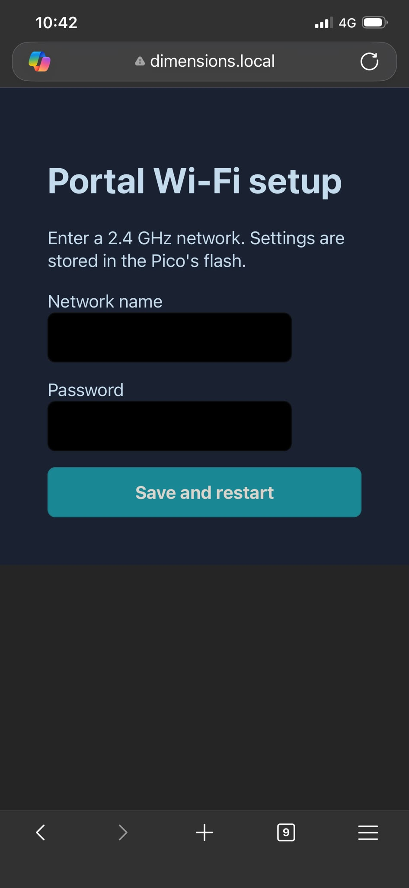
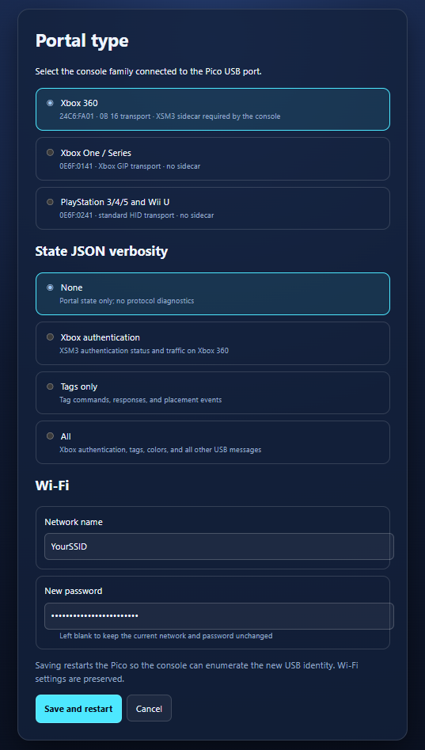

# Portal Simulator user guide

## What you need

- A Raspberry Pi Pico 2 W flashed with `pico_portal_simulator.uf2`.
- A phone or computer with a web browser.
- A 2.4 GHz Wi-Fi network.

## First-time Wi-Fi setup

1. Power the Pico 2 W.
2. Join the open Wi-Fi network `Dimension-Toypad-Setup`.
3. Open `http://192.168.4.1/` (or `http://dimensions.local/`).
4. Enter the 2.4 GHz Wi-Fi SSID and password, then save.
5. Wait for the Pico to restart and join that network.
6. Open `http://dimensions.local/`. If local-name resolution is unavailable, use the IP address assigned by the router.

## Select a portal type

Open **Settings**, select the console portal personality, and save:

- **Standard** for PlayStation 3, PlayStation 4, or Wii U.
- **Xbox One** for Xbox One or Xbox Series consoles. Note: this doesn't properly work *yet*.
- **Xbox 360** for Xbox 360; XSM3 authentication runs on the Pico.

The simulator restarts so the console detects the new USB device. Move the USB cable to the console after setup if the Pico was powered from another device.

## Use virtual toys

1. Find a character or vehicle in the library.
2. Click a toy to cycle through supported forms or vehicle rebuilds.
3. Drag it onto one of the seven portal positions.
4. Drag it to another position to move it, or remove it from the portal to generate a removal event.

A toy model always receives the same deterministic virtual UID, including after restart, so the game recognizes it consistently.

## Change Wi-Fi

Open **Settings** and enter both the new SSID and a non-empty password. The current password is never displayed. Leaving the password blank keeps both existing Wi-Fi values unchanged while still allowing portal and diagnostics settings to be saved.

If the new network cannot be reached, reconnect to `Dimension-Toypad-Setup` and correct the settings at `http://192.168.4.1/` (or `http://dimensions.local/`).

## Diagnostics

The settings page offers four state-detail levels:

- **None**: portal state only.
- **Xbox authentication**: adds Xbox 360 authentication data.
- **Tag only**: adds tag-related USB commands and events.
- **All**: records full available USB and authentication diagnostics.

Use the lowest level needed. Detailed traces consume additional memory and expose low-level traffic in the state API.

## Update firmware

Hold BOOTSEL while connecting the Pico, then copy the new UF2 to the `RPI-RP2` drive. A normal UF2 update retains saved settings. Avoid mass erase unless intentionally resetting Wi-Fi and portal configuration.

## Troubleshooting

- `dimensions.local` does not open: try the device IP address and ensure multicast/mDNS is allowed on the network.
- Setup network does not appear: fully remove power, wait briefly, and reconnect.
- Console does not detect the new portal type: save again, let the Pico restart, then reconnect USB to force enumeration.
- Xbox 360 authentication fails: enable Xbox authentication diagnostics, save the Xbox 360 portal type again, and reconnect USB to force enumeration.
